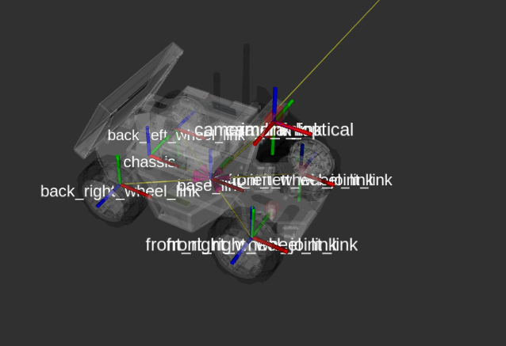
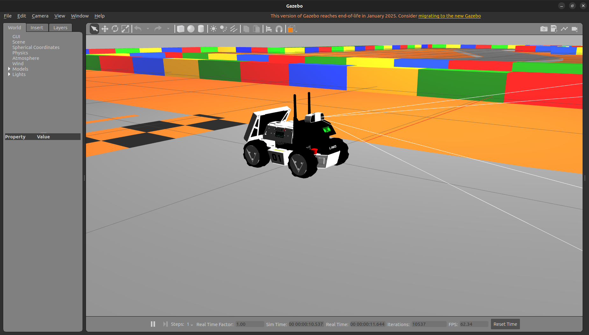

# FRA532_LAB1

To be updated soon.

Pending tasks:
* Implement Extended Kalman Filter (EKF)

## Usage

Run simulation it's has two mode on steering control mode
1. basic
2. nscc (Default)

example :
```bash
# Run the project
ros2 launch robot_bringup robot_bringup.launch.py steering_mode:=nscc

#can change steering_mode to nscc or basic
```

Control with Keyboard

```bash
ros2 run teleop_twist_keyboard teleop_twist_keyboard
```

Controll with Controller Mode
1. pure_pursuit (Default)
2. pid
3. stanley 

example :
```bash
# Run controller
ros2 launch robot_controller robot_controller.launch.py control_mode:=pure_pursuit
#can change control_mode to pure_pursuit, pid or stanley 
```
> [!WARNING]
> When you need to restart the controller, please restart the simulation.
> Please restart simulation

## LAB 1.1 Mobile Robot Kinematics
### 1. Model Ackerman Steering

A 4-wheel mobile robot with Ackerman steering has been created using the Limo robot as a model in the package [`robot_description`](/src/robot_description/), and the TF of the robot is shown below:

<!--  -->


The robot has also been imported into Gazebo in the package `robot_sim`.

<!--  -->


### 2. Inverse Kinematics
Inverse Kinematics has two models: `Basic Model` and `No Slip Condition Constraints`, implemented in the nodes [`InverKinematic-basic.py`](/src/robot_controller/scripts/Kinematic/InverKinematic-basic.py) and [`InverKinematic-nscc.py`](/src/robot_controller/scripts/Kinematic/InverKinematic-nscc.py).

#### 2.1 Basic Model
The Basic Model assumes that the steering angles of both wheels are equal, similar to a bicycle.

The steering angle in the Basic Model is calculated as follows:

```math
\delta = \arctan\left(\frac{\omega \cdot L}{V_x}\right)
```
Where:
* $\delta$ is the steering angle
* $\omega$ is the angular velocity
* $L$ is the wheelbase length
* $V_x$ is the forward velocity


#### 2.2 No Slip condition constraints
The No Slip Condition Constraints model ensures that the steering angles of the two wheels are different, which helps prevent the vehicle from skidding.


```math
\delta = \arctan\left(\frac{\omega \cdot L}{V_x}\right)
```
จากนั้นคำนวณมุมเลี้ยวซ้าย-ขวาตามหลัก Ackermann steering geometry:

```math
\delta_{left} = \arctan\left(\frac{L \cdot \tan(\delta)}{L + 0.5 \cdot W \cdot \tan(\delta)}\right)
```
```math
\delta_{right} = \arctan\left(\frac{L \cdot \tan(\delta)}{L - 0.5 \cdot W \cdot \tan(\delta)}\right)
```

Where:
* $\delta$ is the center steering angle
* $\delta_{left}$ is the left wheel steering angle
* $\delta_{right}$ is the right wheel steering angle
* $L$ is the wheelbase length (distance between front and rear axles)
* $W$ is the track width (distance between left and right wheels)
* $\omega$ is the angular velocity
* $V_x$ is the forward velocity

### 3. Forward Kinematics

Forward Kinematics has 3 Models: `YawRate`,`1Track` and `2Track`,
implemented in the nodes :[`ForwardKinematic-All.py`](/src/robot_controller/scripts/Kinematic/ForwardKinematic-All.py)

#### 3.1 Yaw Rate Model 
For the Yaw Rate model, we calculate velocities from the rear_left and rear_right wheel speeds:

```math
V = \frac{v_{left} + v_{right}}{2}
```
```math
\omega = \frac{v_{right} - v_{left}}{W}
```
Then we update the robot's position and orientation using mid-point integration:


```math
x_{t+1} = x_t + V \cdot dt \cdot \cos\left(\theta_t + \frac{\omega \cdot dt}{2}\right)
```
```math
y_{t+1} = y_t + V \cdot dt \cdot \sin\left(\theta_t + \frac{\omega \cdot dt}{2}\right)
```
```math
\theta_{t+1} = \theta_t + \omega \cdot dt
```
Where:

* $V$ is the linear velocity of the robot
* $\omega$ is the angular velocity of the robot
* $dt$ is the time step
* $(x, y, \theta)$ is the robot's pose (position and orientation)
* $dt$ is the time step
* $\theta$ is the robot's orientation (measured in radians)
#### 3.2 Single-track model
For the Single-Track (Bicycle) model, we calculate the linear velocity from the average of the rear wheels:
```math
V = \frac{v_{rear\_left} + v_{rear\_right}}{2}
```
Then we calculate the angular velocity based on the steering angle:
```math
\omega = \frac{V}{L} \tan(\delta)
```
Finally, we update the robot's position and orientation using mid-point integration:

```math
x_{t+1} = x_t + V \cdot dt \cdot \cos\left(\theta_t + \frac{\omega \cdot dt}{2}\right)
```
```math
y_{t+1} = y_t + V \cdot dt \cdot \sin\left(\theta_t + \frac{\omega \cdot dt}{2}\right)
```
```math
\theta_{t+1} = \theta_t + \omega \cdot dt
```

Where:

* $V$ and $\omega$ are defined in the consolidated section above.
* $v_{rear_left}$ and $v_{rear_right}$ are the rear wheel velocities
* $L$ is the wheelbase length (distance between front and rear axles)
* $\delta$ is the steering angle

#### 3.3 Double-track model
For the Double-Track model, we first calculate the linear velocity from the average of the rear wheels:

```math
V = \frac{v_{rear\_left} + v_{rear\_right}}{2}
```
Then we calculate the angular velocity using a more complex formula that accounts for the full geometry of the vehicle:
```math
\omega = \frac{v_{rear\_right} - v_{rear\_left}}{d_r \cdot [\sin(d_{rl} + \theta) - \sin(d_{rr} + \theta)]}
```
Where:

* $d_r = \sqrt{L^2 + W^2}$ is the distance between the contact points
* $d_{rr} = \arctan(L/W)$ is the angle of the right wheel relative to the robot's frame
* $d_{rl} = \pi - d_{rr}$ is the angle between the left wheel's contact point and the robot's center, measured relative to the robot's orientation

Finally, we update the robot's position and orientation using mid-point integration:

```math
x_{t+1} = x_t + V \cdot dt \cdot \cos\left(\theta_t + \frac{\omega \cdot dt}{2}\right)
```

```math
y_{t+1} = y_t + V \cdot dt \cdot \sin\left(\theta_t + \frac{\omega \cdot dt}{2}\right)
```

```math
\theta_{t+1} = \theta_t + \omega \cdot dt
```

Where:

* $V$ and $\omega$ are defined in the consolidated section above.
* $v_{rear_left}$ and $v_{rear_right}$ are the rear wheel velocities
* $L$ is the wheelbase length
* $W$ is the track width
* $\theta$ is the robot's orientation